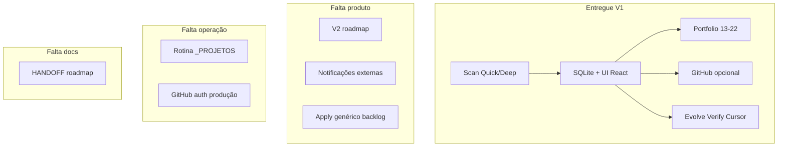

# Max Stack — levantamento: o que já tem e o que falta

**Atualizado:** 2026-05-30 · **Versão produto:** v0.24 · **Repo:** [RivasCode-Ops/max-coding](https://github.com/RivasCode-Ops/max-coding)

Documento de referência única. Para detalhe de cada fase, ver [PRD-MAX-STACK-ALIGNMENT.md](./PRD-MAX-STACK-ALIGNMENT.md) e [README.md](../README.md).

---

## Resumo executivo

| Dimensão | Situação |
|----------|----------|
| **PRD V1 (métricas de sucesso)** | ✅ Fechado — fases 3 a 22 entregues |
| **Produto local-first** | ✅ Scanner, SQLite, UI React, portfolio, GitHub opcional |
| **Apply no repo alvo** | ⚠️ Só com autorização (`apply-pilot`, Cursor tasks, `evolve`) — nunca automático em audit |
| **7 agentes LLM (gstack)** | ⚠️ Papéis são **módulos determinísticos** + prompts Cursor, não 7 chamadas de modelo |
| **Documentação auxiliar** | ⚠️ `HANDOFF.md` e `docs/roadmap.md` **desatualizados** (ainda falam em Fase 1) |

---

## O que já tem (por área)

### Núcleo técnico

| Item | Status | Onde |
|------|--------|------|
| Intake local + URL GitHub | ✅ | `packages/core/lib/intake.mjs` |
| Scanner + perfil | ✅ | `packages/repo-scanner` |
| 12 categorias de health | ✅ | `packages/core/lib/categories.mjs` |
| Achados tipados + evidência | ✅ | `packages/core/lib/findings.mjs` |
| Pipeline por papéis (Scout → … → Verifier) | ✅ | `packages/core/lib/pipeline.mjs` |
| Quick / Deep / Audit CLI | ✅ | `run-quick`, `run-audit`, `analyze` |
| SQLite normalizado | ✅ | `data/max.db` — repos, analyses, findings, feedback, watch_log, etc. |
| Catálogos OSS (vite, next, streamlit, node) | ✅ | `packages/core/catalogs/` |
| GitHub Search (Deep, opcional) | ✅ | `GITHUB_TOKEN` / App |
| Diff entre scans | ✅ | `scan-diff.mjs` |

### Repo único (análise + evolução)

| Item | Status | CLI / UI |
|------|--------|----------|
| Health + categorias + recomendações | ✅ | Quick / Deep |
| Relatório executivo markdown | ✅ | `npm run report` · Exportar relatório |
| Modo plan (backlog + PR plan + QA) | ✅ | `npm run plan` · Exportar plano |
| Sinais de qualidade (16 checks) | ✅ | `npm run quality-signals` · painel na UI |
| Validar test/build/lint | ✅ | `validate-repo` |
| Tendência de health (gráfico) | ✅ | `HealthTrendChart` |
| Apply rules / pilot P1-P2 | ✅ | UI + `apply-pilot` |
| Cursor: aplicar rec + tasks | ✅ | `cursor-apply`, batch P1/P2 |
| Verificar implementação | ✅ | `verify` |
| Busca por ação do usuário | ✅ | Campo na UI |
| Comparar 2 repos | ✅ | Portfolio + comparar |
| Evoluir (scan → pilot → verify) | ✅ | `npm run evolve` |
| Watch repo (re-scan UI) | ✅ | Checkbox monitorar |
| Feedback útil/não útil | ✅ | Por recomendação |
| Git: histórico, hotspots | ✅ | Deep |
| Issues markdown + publicar GitHub | ✅ | Export + API publish |
| PR comment + webhook | ✅ | Fase 5 cloud |

### Portfolio (`_PROJETOS` ou raiz configurável)

| Item | Status | CLI / UI |
|------|--------|----------|
| Descoberta multi-repo + merge SQLite | ✅ | `portfolio` |
| Gráfico de barras (health) | ✅ | Fase 15 |
| Alertas (crítico, regressão, stale) | ✅ | Fase 13 |
| Evolve batch (críticos) | ✅ | `evolve-batch` |
| Watch portfolio + log SQLite | ✅ | Fase 17 |
| Histórico multi-repo (sparklines) | ✅ | Fase 18 |
| Digest executivo markdown | ✅ | Fase 19 |
| Heatmap 12 categorias × repos | ✅ | Fase 20 |
| Metas mín/alvo de health | ✅ | Fase 22 |
| Re-scan portfolio | ✅ | UI / API |

### Qualidade e operação

| Item | Status |
|------|--------|
| `npm run validar` (self-scan + fases 3–22) | ✅ |
| `npm test` (25 suites de teste) | ✅ |
| UI React build (`apps/web`) | ✅ |
| API local `:3847` | ✅ |
| Guia GitHub App/PAT | ✅ [GITHUB-APP.md](./GITHUB-APP.md) |

### Comandos CLI disponíveis (índice)

```
scan · quick · deep · audit · start · validar · validate-repo
portfolio · portfolio-history · portfolio-digest · portfolio-heatmap · portfolio-goals
watch · watch-portfolio · apply-pilot · verify · report · plan · evolve · evolve-batch
pr-comment · quality-signals
```

---

## Fases entregues (3 → 22)

| Fase | v | Tema |
|------|---|------|
| 3 | 0.5 | Structure, validate-repo, trend, feedback, apply rules |
| 4 | 0.6 | Git, portfolio, issues export, pre-commit hook |
| 5 | 0.7 | GitHub App, PR comments, webhook |
| 6 | 0.8 | Trend chart, feedback stats, watch CLI |
| 7 | 0.9 | Apply-pilot, piloto Quadro-Negro |
| 8 | 0.10 | Cursor apply + suggest-action |
| 9 | 0.11 | Verify loop, task registry, apply batch |
| 10 | 0.12 | Repo contexto, sync PR |
| 11 | 0.13 | Export relatório, comparar repos |
| 12 | 0.14 | Evolve workflow |
| 13 | 0.15 | Alertas portfolio + watch UI |
| 14 | 0.16 | Evolve batch + publish issues |
| 15 | 0.17 | Gráfico health portfolio |
| 16 | 0.18 | Plan mode (pacote autorizado) |
| 17 | 0.19 | Watch portfolio + log |
| 18 | 0.20 | Histórico multi-repo |
| 19 | 0.21 | Digest portfolio |
| 20 | 0.22 | Heatmap categorias |
| 21 | 0.23 | Quality signals |
| 22 | 0.24 | Metas de health |

**Não há Fase 23+ definida no PRD** — próximo trabalho é V2 ou operação.

---

## O que falta (lacunas reais)

### Produto / funcional

| Lacuna | Prioridade | Notas |
|--------|------------|--------|
| **Fase 23+ no PRD** | — | Roadmap numérico V1 encerrado; falta planejar V2 |
| **7 agentes como LLM separados** | Baixa (decisão) | Por design: pipeline local, não gstack plug-and-play |
| **Apply automático no repo alvo** | Fora V1 | Regra do produto: audit default, apply só com autorização |
| **Notificações** (email, Slack, desktop) | Média V2 | Watch gera log/alertas na UI, sem push externo |
| **Agendamento OS** (cron/Task Scheduler) | Média V2 | `watch-portfolio` é processo CLI contínuo, não serviço Windows |
| **Heatmap no digest** | Baixa | Digest tem metas/alertas; heatmap só na UI/API separada |
| **Quality signals no portfolio** | Baixa | Por repo sim; agregado no portfolio não |
| **Modo `apply` end-to-end** | Média | Existe pilot/Cursor/evolve; não há `npm run apply` genérico de backlog |
| **AST / análise profunda de código** | V2 | PRD original marca fora de escopo V1 |
| **Multi-tenant SaaS** | Fora escopo | Bloco G enterprise |
| **Auto-merge PRs** | Fora escopo | Bloco G |

### Operação / uso real (não é código faltando)

| Lacuna | Notas |
|--------|--------|
| Rodar `evolve-batch` / `watch-portfolio` em produção em `c:\_PROJETOS` | Ferramentas existem; falta rotina operacional |
| GitHub App/PAT em todos os repos | Configuração manual ([GITHUB-APP.md](./GITHUB-APP.md)) |
| Piloto contínuo Quadro-Negro e outros críticos | Evolve/verify disponíveis; backlog de execução no **repo alvo** |
| Feedback de usuários em escala | Mecanismo existe; volume de dados depende do uso |

### Documentação e DX

| Arquivo | Problema |
|---------|----------|
| [HANDOFF.md](../HANDOFF.md) | Data 2026-05-28, “Fase 1 parcial”, próximos passos já feitos |
| [docs/roadmap.md](./roadmap.md) | Checkboxes antigas; contradiz README/PRD |
| [docs/prd.md](./prd.md) | Critérios MVP com `[ ]`; V1 já superou |
| [docs/COPY-PRODUTO.md](./COPY-PRODUTO.md) | Linha “V2 UI: React” obsoleta (UI já existe) |

### Testes / CI do próprio max-coding

| Item | Status |
|------|--------|
| Testes unitários por fase | ✅ `tests/phase*.test.mjs` |
| CI GitHub Actions no repo max-coding | ⚠️ Verificar se workflow cobre `npm run validar` em PRs |
| E2E UI (Playwright) | ❌ Não implementado |

---

## Fora de escopo (explícito no PRD)

- Multi-tenant SaaS  
- Sandbox irrestrito / execução de comandos sem limite  
- Auto-merge de PRs  
- Edição agressiva automática no repo alvo  

---

## Sugestões de próximo trabalho (V2 ou higiene)

### Higiene rápida (sem feature nova)

1. Atualizar `HANDOFF.md`, `roadmap.md`, `prd.md` (ou marcar como arquivo histórico).  
2. Alinhar COPY-PRODUTO (“V2 UI” → entregue).  
3. Tag git `v0.24` + notas de release curtas.

### V2 — candidatos por valor

| Ideia | Descrição |
|-------|-----------|
| **Fase 23 — Notificações** | Webhook local ou arquivo quando watch detecta regressão |
| **Fase 24 — Serviço watch** | Instalador Windows / task agendada para `watch-portfolio` |
| **Fase 25 — Scorecard ZIP** | Export bundle: digest + heatmap SVG + scorecards por repo |
| **Fase 26 — Apply plan** | Fluxo UI: plan → aprovar itens → cursor-batch → verify |
| **Quality portfolio** | Média de sinais de qualidade por pasta `_PROJETOS` |

### Uso recomendado agora (sem codar)

```bash
npm run validar
npm start
npm run portfolio-digest -- c:\_PROJETOS
npm run portfolio-goals -- set 70 85
npm run watch-portfolio -- c:\_PROJETOS 3600
```

---

## Mapa mental



---

## Referências

- [PRD-MAX-STACK-ALIGNMENT.md](./PRD-MAX-STACK-ALIGNMENT.md) — blocos A–X  
- [README.md](../README.md) — comandos e tabelas por fase  
- [COPY-PRODUTO.md](./COPY-PRODUTO.md) — capacidades 1–10  
- [gstack-mapping.md](./gstack-mapping.md) — papéis vs pipeline  
