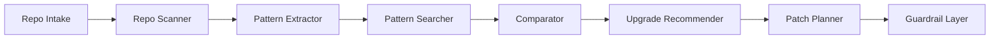

# PRD — max-coding

> **Status 2026-05-30:** critérios MVP (Fase 1) e expansões V1 (fases 2–22) **concluídos** em v0.24. Detalhe de entregas: [PRD-MAX-STACK-ALIGNMENT.md](./PRD-MAX-STACK-ALIGNMENT.md). Pendências pós-marco: [LEVANTAMENTO.md](./LEVANTAMENTO.md).

## 1. Objetivo

Entregar um pipeline repetível: **repo in → perfil técnico → padrões internos/externos → recomendações priorizadas**.

## 2. Personas

| Persona | Necessidade |
|---------|-------------|
| Dev solo | Saber o que melhorar no repo sem ler 50 READMEs de referência |
| Agente (Cursor) | Regras/skills e backlog derivados do scan, não genéricos |
| Mantenedor | Issues/PR plan com impacto e esforço |

## 3. Fluxo principal

1. **Intake** — path local ou `owner/repo` (GitHub)
2. **Scanner** — stack, pastas, `package.json`/`requirements.txt`, testes, CI, Docker, docs
3. **Extractor** — convenções internas (lint, estrutura `src/`, histórico git opcional)
4. **Searcher** — queries GitHub (stack + keywords); cache de resultados
5. **Comparator** — gap analysis (o que referências têm e nós não)
6. **Recommender** — sugestões categorizadas + scores
7. **Patch Planner** — tasks/issues (Markdown/JSON)
8. **Guardrails** — somente leitura na v1; execução exige flag explícita

## 3.1 Orquestração multi-papel (gstack-inspired)

Ver `docs/gstack-mapping.md`. Papéis não são LLMs separados na v1 — são **fases** do pipeline + prompts Cursor em `docs/agents/`.

## 4. Requisitos funcionais

### RF-01 Perfil técnico
- Saída JSON com: linguagens, frameworks, scripts npm/pnpm, presença de testes, CI, linter, README, LICENSE, `.cursor/rules`

### RF-02 Padrões internos
- Lista de sinais: monorepo, camadas, cobertura de testes (heurística), secrets no git (heurística)

### RF-03 Padrões externos
- Mínimo 3 repos de referência por scan (GitHub search API ou lista curada)
- Metadados: stars, topics, último push (quando API disponível)

### RF-04 Recomendações
- Categorias: arquitetura, performance, segurança, testes, DX, observabilidade, docs, infra, qualidade, padronização
- Campos obrigatórios: ver [recommendation-model.md](./recommendation-model.md)

### RF-05 Relatório
- Markdown executivo + JSON machine-readable em `reports/<repo-slug>/<timestamp>/`

### RF-06 Audit pipeline
- Comando `npm run audit -- <path>` gera handoff + report + backlog + verification template

## 5. Requisitos não funcionais

- Scan de repo médio (<500 arquivos) em <30s local
- Sem enviar código-fonte para terceiros na v1 (só metadados + paths)
- Funcionar offline parcial (scan local sem busca GitHub)

## 6. Critérios de aceite (MVP — Fase 1)

- [x] CLI `scan` / `quick` / `deep` gera perfil e relatórios (`profile.json`, `recommendations`, `report-*.md`)
- [x] Pipeline `audit` / `recommend` integrado ao SQLite e UI
- [x] Recomendações acionáveis no piloto (Quadro-Negro) e self-scan
- [x] Cada recomendação com impacto, esforço, risco, prioridade

## 7. Fora de escopo v1 (inalterado como limite de produto)

- Auto-PR / merge automático no repo alvo
- Análise AST profunda (V2)
- SaaS multi-tenant

*Nota:* UI web (`apps/web`) foi entregue na V1 consolidada (v0.24); o item histórico “UI web completa” no PRD original refere-se ao escopo inicial mínimo, hoje superado.

## 8. Métricas de sucesso

- % recomendações marcadas como “úteis” pelo usuário (feedback manual)
- Tempo do dev para primeiro backlog de melhoria < 15 min após clone
